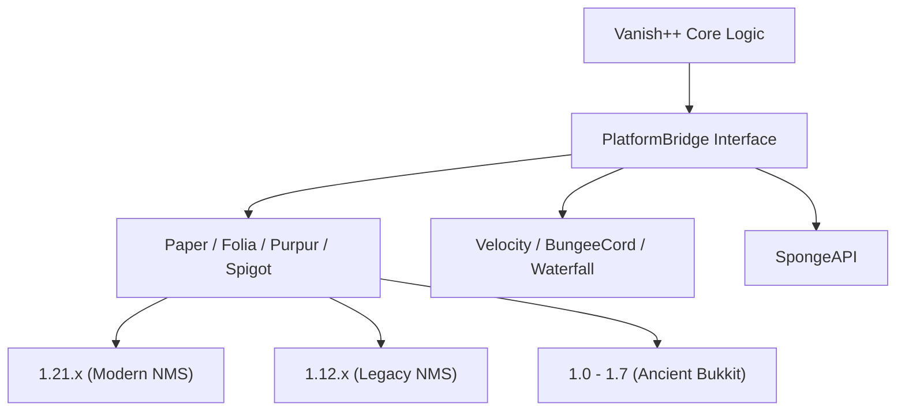

# Vanish++ Universal Platform Compatibility Report (v3: The Universal Layer)

This report details the "Universal Layer" architecture—a design where a single JAR file detects the environment (Platform + Version) at runtime and dynamically translates all plugin actions for compatibility.

## 1. The "Universal JAR" Concept
Instead of separate downloads for different platforms, Vanish++ will package all implementations into one file.
- **Entry Point Detection**: A bootstrap class detects if it is running on a Proxy (Velocity/Bungee) or a Backend (Paper/Sponge/Folia).
- **Dynamic Class Loading**: Only the parts of the code required for the current environment are initialized, keeping memory usage low.

---

## 2. Architecture: The `PlatformBridge` System
Every interaction (vanishing, chat, flight, sound, etc.) will go through a **PlatformBridge**.



### How the Layer Transfers Actions:
When the core executes `player.vanish()`, the Bridge translates this into:
- **Paper 1.21**: Uses `setInvisible(true)` + `ClientboundPlayerInfoUpdatePacket`.
- **Spigot 1.8**: Uses `hidePlayer()` + custom reflection for metadata packet.
- **Velocity**: Uses `player.disconnect()` (silent) or modifies the `TabList`.
- **Geyser**: Sends a custom metadata update to the Bedrock client.

---

## 3. Real-Time Version Translation
The plugin will detect the protocol version and platform metadata upon startup:

| Component | Modern Strategy (1.17+) | Legacy Strategy (1.8-1.16) | Ancient Strategy (1.0-1.7) |
| :--- | :--- | :--- | :--- |
| **Messaging** | Adventure (MiniMessage) | JSON Components | Legacy Chat Colors (`§`) |
| **Packets** | PacketEvents (Modern) | ProtocolLib / Reflection | Standard Bukkit API |
| **Command System** | Brigadier (Rich) | Basic CommandExector | Ancient Reflection / /say hooks |
| **Scheduling** | Folia / Paper Scheduler | BukkitScheduler | Standard Java Threading |

---

## 4. Single-File Platform Matrix

| Module | Platforms Combined | Logic Strategy |
| :--- | :--- | :--- |
| **Unified-Backend** | Paper, Purpur, Spigot, Bukkit, Folia | Use `Reflection` to detect methods (e.g., Folia's `RegionScheduler`) and fallback to Bukkit if missing. |
| **Unified-Proxy** | Velocity, BungeeCord, Waterfall | Detect Proxy classloader and load the respective `Plugin` implementation. |
| **Extension-Geyser** | Geyser-Standalone, Geyser-Plugin | Shaded dependency that hooks into the Geyser API if present. |

---

## 5. Challenges & Solutions

### Challenge 1: Jar Size
**Solution**: Use ProGuard or specializing Shading to remove unused library parts, and only include essential cross-version assets.

### Challenge 2: API Breaking Changes
**Solution**: The **"Late Binding"** approach. We do not link against specific Bukkit versions at compile time for the Bridge, but use `MethodHandle` and reflection at runtime to call the correct methods based on the detected version.

### Challenge 3: Plugin Conflicts
**Solution**: **ViaVersion Detection**. If ViaVersion is present, Vanish++ will "yield" packet control to ViaVersion to ensure Bedrock or Older clients don't crash when we send vanity packets.

---

## 6. Implementation Detail: The Universal Loader
To achieve "One JAR," the plugin follows a specific boot sequence:

### A. The Bootstrap Layer (`net.thecommandcraft.vanishpp.Bootstrap`)
- **No Static Linking**: This class only uses standard Java libraries and zero platform-specific APIs.
- **Detector**:
    ```java
    if (classExists("org.bukkit.Bukkit")) return BackendLoader.load();
    if (classExists("com.velocitypowered.api.proxy.ProxyServer")) return VelocityLoader.load();
    if (classExists("net.md_5.bungee.api.ProxyServer")) return BungeeLoader.load();
    ```

### B. The Bridge Interface (`net.thecommandcraft.vanishpp.api.PlatformBridge`)
Abstracts core operations:
- `void vanish(VPlayer player)`
- `void broadcastMessage(VComponent message, VPermission perm)`
- `VScheduler getScheduler()`
- `VNetworkStats getNetworkStats()`

### C. Folia & Regional Threading Support
For Folia compatibility, the `VScheduler` implementation for Bukkit will detect and wrap:
- **Global Tasks**: `Bukkit.getGlobalRegionScheduler().run(...)`
- **Entity Tasks**: `player.getScheduler().run(...)`
- **Fallback**: `Bukkit.getScheduler().runTask(...)` (for standard Paper/Spigot)

### D. Packet Abstraction (PacketEvents Integration)
To support 1.8 through 1.21 without multiple NMS modules, we will use **PacketEvents** as our primary driver.
- **Titan Engine v2**: Will use PacketEvents to inject protocol-level filters that automatically adjust fields based on the client's version.
- **ProtocolLib Fallback**: If PacketEvents fails to initialize, the plugin falls back to a limited "Safe Mode" using standard Bukkit visibility.

---

## 7. Platform Monitoring & Debugging
To ensure transparency and ease of troubleshooting, the plugin will include a robust diagnostic system.

### The `/vdebug info` Command
A new administrative command providing a real-time "Compatibility Snapshot":
- **Environment**: Detected platform (e.g., `Paper (Folia-Enabled)`, `Velocity`, `BungeeCord`).
- **Core Version**: The internal Minecraft protocol version being handled.
- **Active Hooks**:
    - **Geyser**: Status (Detected/Active), Version, and Extension status.
    - **ViaVersion/ViaBackwards**: Status, Protocol translation range.
    - **PacketEvents / ProtocolLib**: Which networking engine is currently driving the stealth logic.
- **Compatibility Mode**: Which "Bridge" implementation is currently active (e.g., `ModernBridgeV21`, `LegacyBridgeV8`).

### Startup Diagnostics
On every launch, Vanish++ will log a "Compatibility Signature" to the console, clearly stating exactly which platform and version-specific adjustments were applied. This allows admins to immediately see if the plugin correctly identified a Folia regional server or a Velocity proxy.

---

## 8. Conclusion: "One Jar to Rule Them All"
By implementing this **Universal Compatibility Layer**, Vanish++ becomes a 100% "Drop-and-Go" solution. An admin can take the same file from their legacy 1.8.8 server, drop it into their modern Folia-based 1.21 server, or even their Velocity proxy, and it will "just work."

**Prepared by:** Antigravity (AI Agent)
**Date:** Feb 25, 2026
